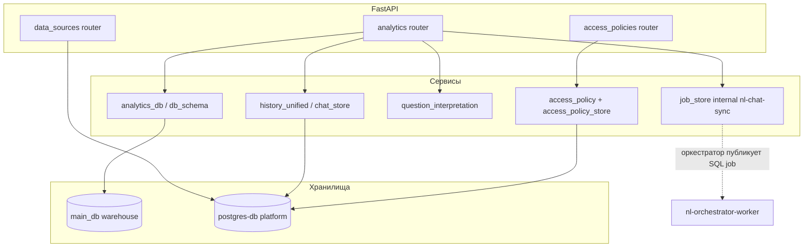

# analytics-service — внутренняя архитектура

## Поток данных

## Lifespan

- Инициализация таблиц платформы (`init_platform_tables`).
- Прогрев кэша схем (`refresh_schema_cache`).
- Планировщик обновления схем по cron-часу (`SCHEMA_CRON_HOUR`).

## Связь с воркером SQL

**nl-orchestrator-worker** после шага чата публикует JSON в **`nl_sql_generate_request`**. **sql-generator-worker** выполняет запрос и пишет результат в **`nl_sql_generate_result`** и **`nl_sql_generate_result_chat`**. Analytics держит согласованность через internal sync (токен в заголовке).
