# Архитектура системы

Микросервисная платформа с **BFF** как единственной публичной точкой для клиента по **HTTP** (REST, **SSE** для уведомлений), **WebSocket** (NL-чат), **двумя PostgreSQL** (платформа и витрина данных), **RabbitMQ** для асинхронных сценариев NL→SQL, отчётов и email, **Redis** для rate limiting на BFF и для real-time ветки потока уведомлений (pub/sub при наличии Redis).

Термины: [glossary.md](glossary.md). Перечень модулей в коде: [implementation-scope.md](implementation-scope.md). Очереди и участники: [infrastructure/messaging.md](infrastructure/messaging.md). По сервисам: [README.md](README.md) и каталоги `docs/<сервис>/`.

## Диаграмма контейнеров

Обзорная карта: браузер обращается к фронту и к BFF (напрямую или через nginx). **SSE** обслуживается тем же **bff-service** по обычному HTTP. **Redis** связан с BFF (rate limit и канал обновлений для SSE).

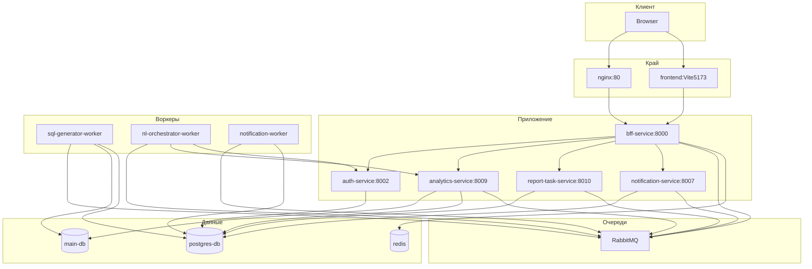

## Поток NL-чата (упрощённо)

Сводная последовательность. **Пошаговый разбор** — в разделе [NL-чат: детально](#nl-чат-детально) ниже.

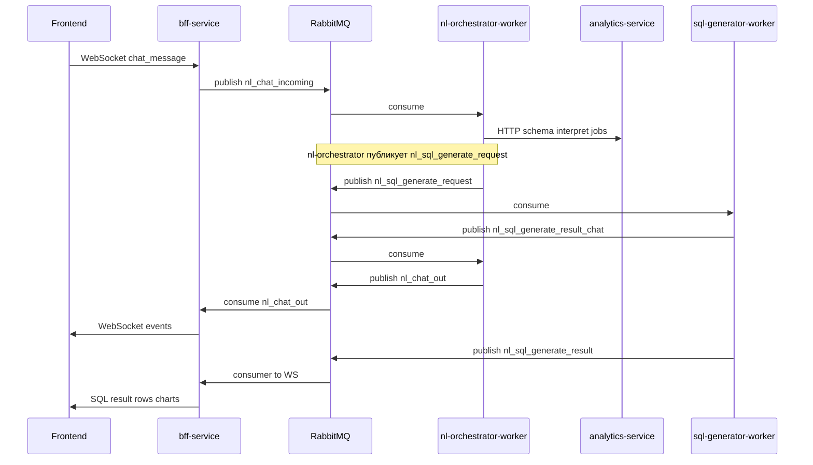

Исходники: [nl-orchestrator-worker/app/worker_main.py](../nl-orchestrator-worker/app/worker_main.py), [bff-service/app/services/chat_mq.py](../bff-service/app/services/chat_mq.py), [bff-service/app/services/analytics_mq_consumer.py](../bff-service/app/services/analytics_mq_consumer.py).

## NL-чат: детально

### Фаза 1 — сообщение пользователя, схема, интерпретация, план и постановка SQL

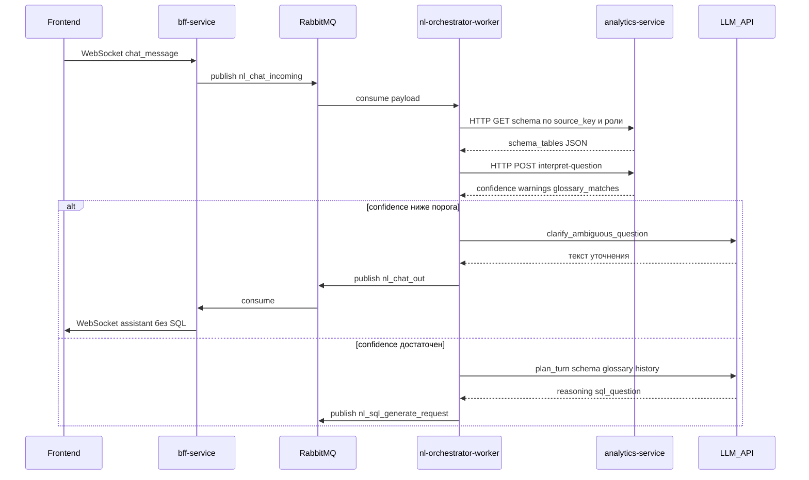

### Фаза 2 — генерация SQL, guardrails, выполнение, синхрон истории, ответ в чат

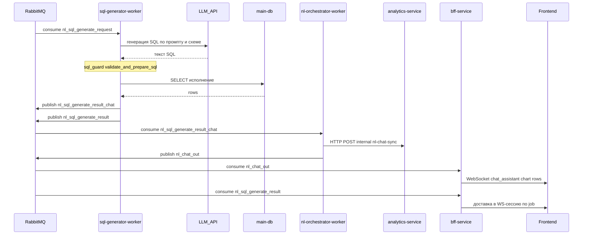

Код: [sql-generator-worker/app/services/sql_guard.py](../sql-generator-worker/app/services/sql_guard.py), [sql-generator-worker/app/worker_main.py](../sql-generator-worker/app/worker_main.py).

## Интерпретация вопроса и ветка confidence

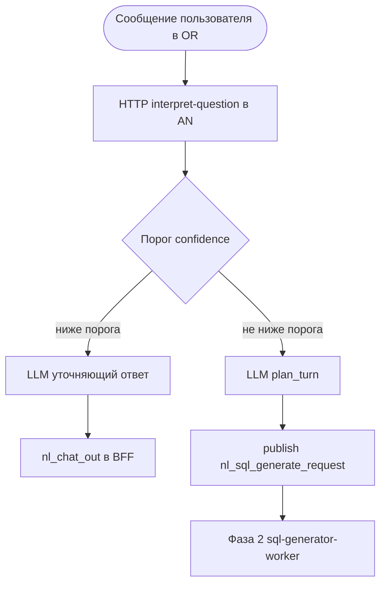

## Плановый отчёт (report task)

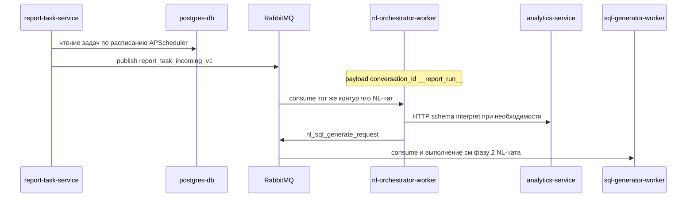

## Уведомления в браузере (SSE)

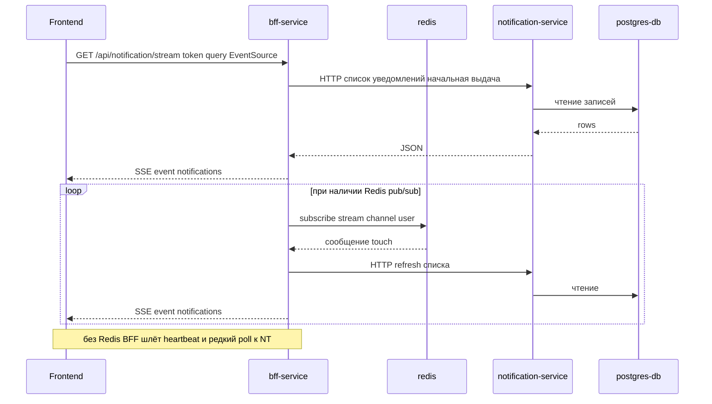

Код: [bff-service/app/api/notification.py](../bff-service/app/api/notification.py), [bff-service/app/services/notification_realtime.py](../bff-service/app/services/notification_realtime.py).

## Email через очередь

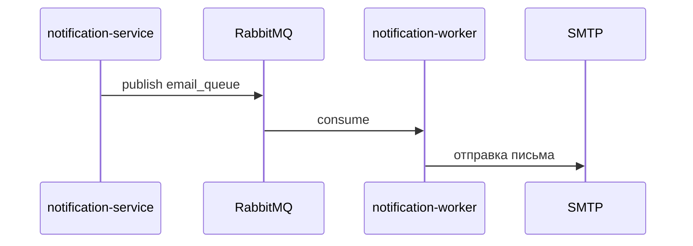

## Аутентификация (JWT)

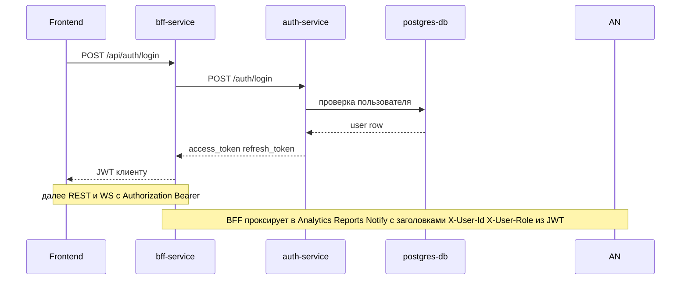

## Поток данных warehouse vs platform

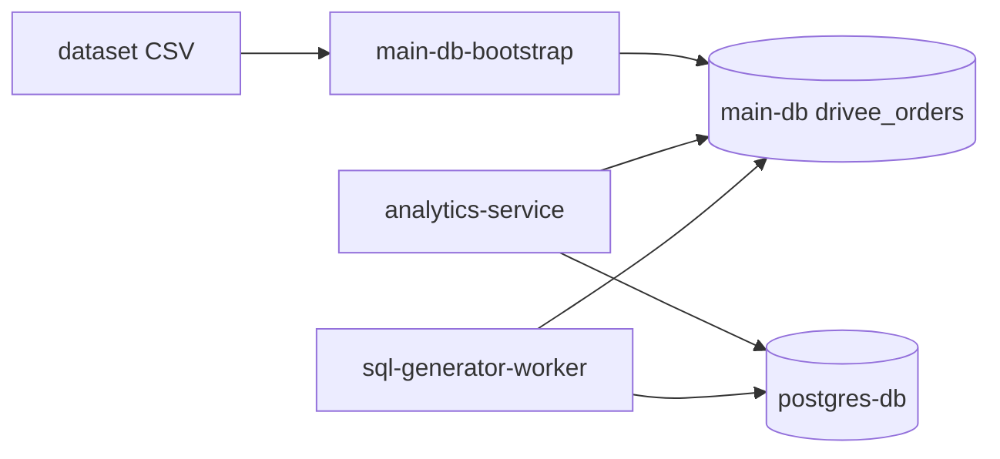

## NL-чат (team work space): создание сессии, инвайт, совместный просмотр и клон

Данные в **postgres-db** (платформа): сессия `nl_chat_sessions` (владелец `user_id`), сообщения `nl_chat_messages`, приглашения `nl_chat_invites`, выданный доступ гостя `nl_chat_access` (`access_role`, обычно `viewer`). Код: [chat_store.py](../analytics-service/app/services/chat_store.py), HTTP в [analytics.py (AN)](../analytics-service/app/api/analytics.py) и [analytics.py (BFF)](../bff-service/app/api/analytics.py), WS [websocket.py](../bff-service/app/api/websocket.py), рассылка ответов чата [chat_mq.py](../bff-service/app/services/chat_mq.py).

### Создание пустого чата

Клиент получает `conversation_id` до первого сообщения; сообщения по-прежнему идут через WebSocket и (для персиста) sync в analytics.

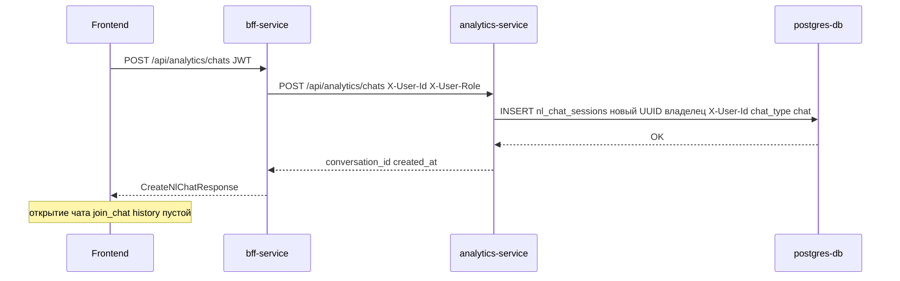

### Инвайт по email: добавление пользователя с доступом viewer

Владелец создаёт строки в `nl_chat_invites` со статусом `pending`; BFF при известном пользователе по email шлёт уведомление в очередь и (при Redis) touch для SSE. Приглашённый принимает инвайт — создаётся `nl_chat_access` для пары (conversation_id, invitee_user_id).

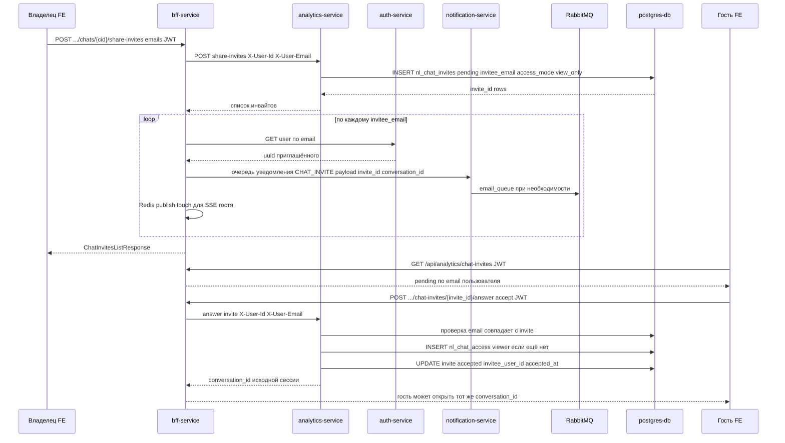

### Совместный просмотр: владелец и гость одновременно

Оба подключаются к одной WebSocket-комнате `chat:{conversation_id}` после успешной проверки доступа (владелец по `nl_chat_sessions.user_id`, гость по `nl_chat_access`). События `nl_chat_out` из RabbitMQ BFF рассылает **всем** подписчикам комнаты. Отправка новых сообщений (`chat_message`) разрешена только владельцу; гость получает ошибку read-only.

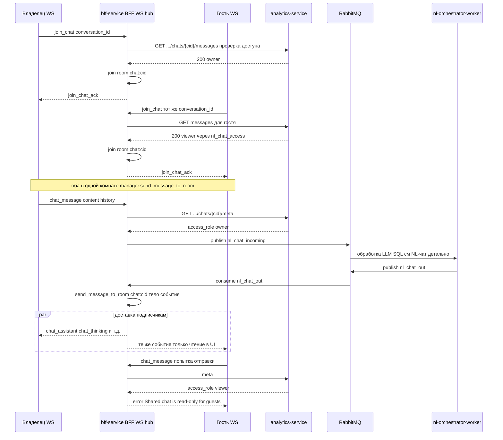

### Клон чата для гостя (clone-for-me)

Копируется **сессия** и **все сообщения** в новую сессию, где `user_id` = приглашённый (он становится владельцем копии). Исходный расшаренный чат не меняется; `NlChatAccess` на старый `conversation_id` остаётся.

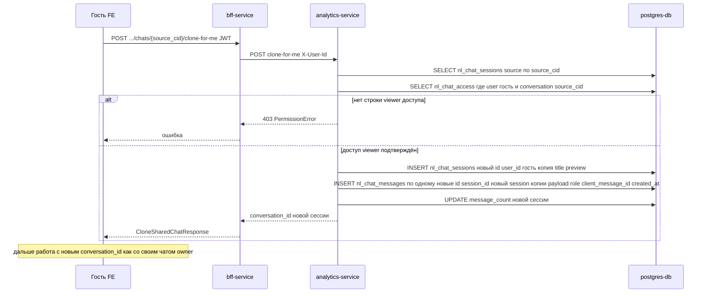

Исходники операций: `create_empty_session`, `create_chat_invites`, `accept_chat_invite`, `clone_shared_chat_for_viewer`, `_clone_chat_for_user` в [chat_store.py](../analytics-service/app/services/chat_store.py).

## Внешние зависимости

- **LLM API** (OpenAI-совместимый endpoint): analytics-service, sql-generator-worker, nl-orchestrator-worker — переменные `LLM_API_KEY`, `LLM_BASE_URL`, `LLM_MODEL`.

## Дополнительно

- **CloudPub** публикует `nginx:80` наружу при заданном `CLOUDPUB_TOKEN` — см. [infrastructure/edge.md](infrastructure/edge.md).
