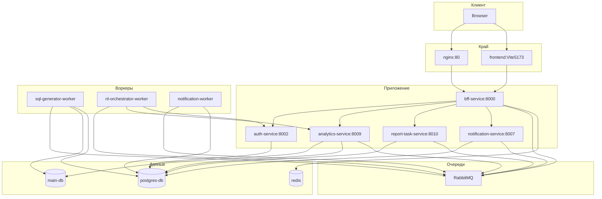
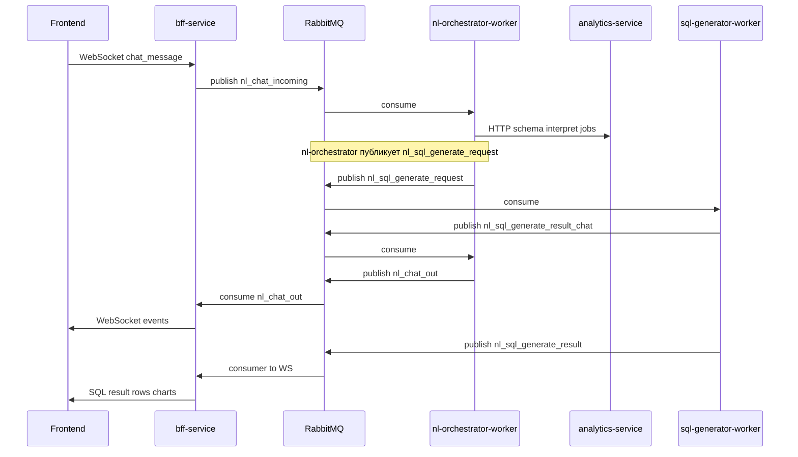
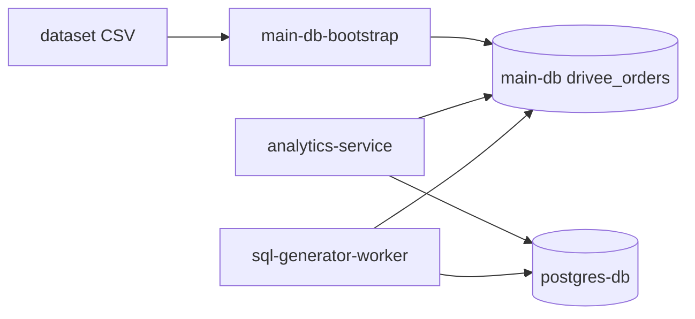

# Архитектура системы

Микросервисная платформа с **BFF** как единственной публичной HTTP/WebSocket точкой для фронтенда, **двумя PostgreSQL** (платформа и витрина данных), **RabbitMQ** для асинхронных сценариев NL→SQL, отчётов и email, **Redis** для опционального rate limiting на BFF.

Подробности по компонентам: [README.md](README.md) и папки `docs/<сервис>/`. Очереди: [infrastructure/messaging.md](infrastructure/messaging.md).

## Диаграмма контейнеров

## Поток NL-чата (упрощённо)

На практике шаги и типы событий богаче (статусы, ошибки, reasoning); детали в [nl-orchestrator-worker/worker_main.py](../nl-orchestrator-worker/app/worker_main.py) и [bff-service/services](../bff-service/app/services/).

## Поток данных warehouse vs platform

## Внешние зависимости

- **LLM API** (OpenAI-совместимый endpoint): analytics-service, sql-generator-worker, nl-orchestrator-worker — переменные `LLM_API_KEY`, `LLM_BASE_URL`, `LLM_MODEL`.

## Дополнительно

- **CloudPub** публикует `nginx:80` наружу при заданном `CLOUDPUB_TOKEN` — см. [infrastructure/edge.md](infrastructure/edge.md).
