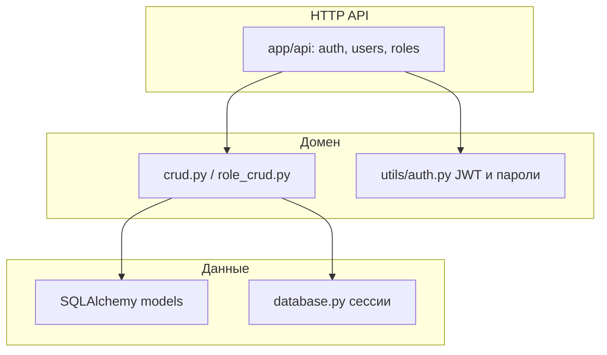

# auth-service — внутренняя архитектура

## Слои

## Типовой сценарий

1. Клиент обращается к **BFF** `/api/auth/*`.
2. BFF проксирует запрос в **auth-service**.
3. Сервис проверяет учётные данные, читает/пишет строки в `postgres-db`, возвращает токены или профиль.

## Миграции

[`app/db_migrate.py`](../../auth-service/app/db_migrate.py) — инициализация/обновление схемы при старте (см. `main.py`).
