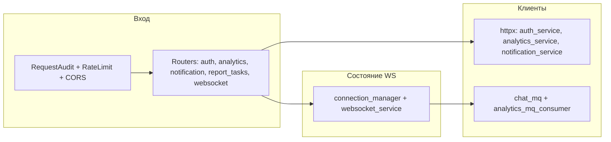

# bff-service — внутренняя архитектура

## Слои

## Lifespan

При старте приложения (`app/main.py`):

1. Подключение Redis (если задан URL).
2. `chat_bus.start()` — каналы RabbitMQ для чата.
3. `start_consumer()` — подписка на `nl_sql_generate_result` и проброс в WebSocket.

При остановке — обратный порядок.

## Типовые сценарии

**REST:** клиент с Bearer → BFF валидирует JWT (через auth или локально) → прокси с заголовками пользователя в analytics/report-task.

**NL-чат:** клиент WebSocket → сообщение в `nl_chat_incoming` → ответы из `nl_chat_out` и события из consumer результата SQL (очередь `nl_sql_generate_result`).
