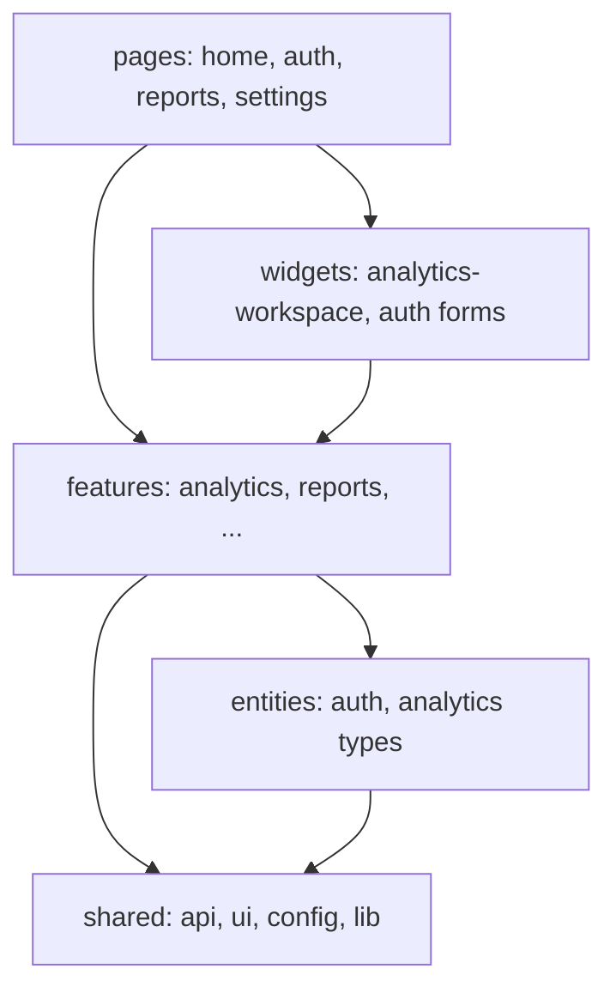

# frontend — внутренняя архитектура

## Слойность (Feature-Sliced подход)

- **app/** — роутинг (`router.tsx`), layout, providers, защищённые маршруты.
- **features/analytics** — NL-чат, панель, графики, подписка на WebSocket.
- **features/reports** — задачи отчётов, модалки.
- **entities/auth** — хуки логина/регистрации.
- **shared** — axios instance, UI kit, локали.
