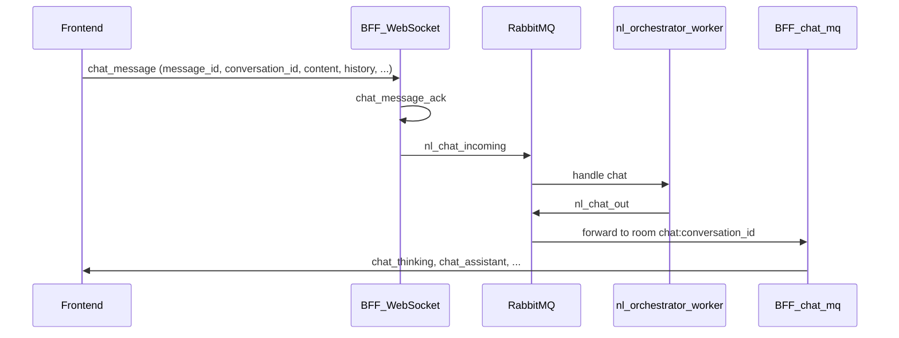

# NL-чат, WebSocket (BFF) и модалка отчётов

Сквозное описание поведения, которое затрагивает [frontend](../../frontend/), BFF, analytics-service и [nl-orchestrator-worker](../../nl-orchestrator-worker/). Код — источник истины; здесь — навигация и контракты.

## Поток сообщения пользователя (sequence)

Клиент сначала вызывает `join_chat` с `conversation_id` и встаёт в комнату `chat:{uuid}`. События с других `conversation_id` в подписчике NL-чата отфильтровываются.

## Формат фреймов (BFF NL-чат)

Соединение: WebSocket BFF, токен в query (см. [websocket-client.md](websocket-client.md)).

И входящие, и исходящие сообщения — **JSON с полем `type` на корне** (плоский объект). Отправка с клиента: `wsClient.sendPlain({ ... })` (не обёртка `{ type, payload }`).

## Исходящие типы, релевантные NL-чату

Сторона **BFF** (сокет с пользователем и/или [`chat_mq.py`](../../bff-service/app/services/chat_mq.py) из очереди `nl_chat_out`):

| `type` | Назначение |
|--------|------------|
| `connection_established` | Успешное подключение. |
| `join_chat_ack` / `left_chat` | Подтверждение join/leave комнаты `chat:*`. |
| `chat_message_ack` | BFF принял `chat_message` в Rabbit. |
| `chat_thinking` | Стрим «ход мыслей» ассистента. |
| `chat_assistant` | Финальный (или частичный) ответ, таблица, ошибка. |
| `chat_sql_queued` | Сообщение в ленте: запрос поставлен в SQL-очередь. |
| `chat_messages_deleted` | Синхронизация удаления: список `message_ids` (UI-идентификаторы) для сессии. |
| `delete_chat_messages_ack` | Ответ инициатору удаления по WS. |
| `error` | Ошибка обработки кадра. |

Подписка на фронте: [`../../frontend/src/features/analytics/lib/subscribe-nl-chat-ws.ts`](../../frontend/src/features/analytics/lib/subscribe-nl-chat-ws.ts) (`chat_thinking`, `chat_assistant`, `chat_sql_queued`, `chat_messages_deleted`).

## Входящие от клиента (BFF), NL-чат

| `type` | Ключевые поля | Действие |
|--------|----------------|----------|
| `join_chat` / `leave_chat` | `conversation_id` | Комната `chat:{uuid}`. |
| `chat_message` | `conversation_id`, `content`, `message_id` (опц.), `history`, … | [websocket.py](../../bff-service/app/api/websocket.py) → `chat_bus.publish_incoming` → `nl_chat_incoming`. |
| `delete_chat_messages` | `conversation_id` и **одно из:** `from_message_id` **или** `message_ids` (до 32) | Прокси в analytics ([AnalyticsProxy.delete_nl_chat_messages_tail / delete_nl_chat_messages](../../bff-service/app/services/analytics_service.py)), затем рассылка `chat_messages_deleted` в комнату. |

## Удаление сообщений (БД + WS)

**Analytics REST** (внутренне или через BFF-прокси `X-User-Id`):

- `POST /api/analytics/chats/{conversation_id}/messages/delete` — тело `{ "message_ids": ["…"] }`, удаление по PK строки **или** по `client_message_id`.
- `POST /api/analytics/chats/{conversation_id}/messages/delete-tail` — тело `{ "from_message_id": "…" }`: с якоря (включительно) и всех следующих по времени в сессии. Нужен для **retry** одного вопроса, когда после него было ещё N реплик.

Реализация: [`../../analytics-service/app/services/chat_store.py`](../../analytics-service/app/services/chat_store.py) (`delete_messages_by_keys`, `delete_messages_from_anchor_inclusive`).

**Семантика WS:** при успехе BFF шлёт в `chat:{cid}` объект `chat_messages_deleted` с `message_ids` — список **UI-идов** удалённых сообщений, чтобы все вкладки сняли строки с ленты. Инициатору дополнительно `delete_chat_messages_ack` (и при tail — поле `from_message_id` в ack, если предусмотрено в коде).

## Идентификаторы: user vs assistant

- **Пользователь:** клиент генерирует `message_id` (UUID) и кладёт в `chat_message`; тот же id у оптимистичной строки. Воркер пишет в БД `user_message` с тем же `client_message_id` (см. sync в воркере).
- **Ассистент:** в [worker_main.py](../../nl-orchestrator-worker/app/worker_main.py) для хода выделяется отдельный **`assistant_message_id`** (UUID), отличный от `message_id` пользователя. Все `chat_thinking` / `chat_assistant` и sync `assistant_message` используют его. Поле `PendingCtx` в воркере: `assistant_message_id`. Это устраняет слияние user+assistant в одну React-строку по одному `id`.
- **Строки из GET** [`../../frontend/src/features/analytics/lib/nl-chat-transcript.ts`](../../frontend/src/features/analytics/lib/nl-chat-transcript.ts): `id: row.id` (первичный ключ БД) — уникальные ключи списка и согласованность при дублирующихся исторических `client_message_id`.

## Устойчивость ленты на фронте

Файл [`../../frontend/src/features/analytics/lib/use-nl-orchestrator-chat.ts`](../../frontend/src/features/analytics/lib/use-nl-orchestrator-chat.ts).

- Загрузка транскрипта по **`conversationId` только** (без `t` из i18n в deps), иначе лишние `fetch` затирали оптимистичные строки при смене ссылки на `t`.
- **`pendingUserLineRef`:** если ответ API пришёл до появления user-строки в БД, в ленту подмешивается последнее ожидаемое user-сообщение; ref очищается при смене сессии и при появлении записи в ответе.
- **`appendLine`:** обновление по тому же `id` сливается **только** если существующая строка — **assistant** (thinking → финал). Иначе при коллизии с user добавляется отдельная строка с суффиксом (`-a`) для совместимости со старым поведением воркера.
- **Retry + сервер:** якорь хвоста + `requestDeleteChatTailFrom` + `trimForRetry` (см. `analytics-workspace`).

## Модалка отчёта (фокус)

[`../../frontend/src/features/reports/ui/create-report-modal.tsx`](../../frontend/src/features/reports/ui/create-report-modal.tsx): панель диалога с `role="dialog"`, `aria-modal="true"`; при `open` фокус переносится с элемента вне модалки (в т.ч. с поля чата) на первый `input`/`textarea` внутри — для доступности при переходе «из чата в отчёт».

## Тулбар у ответа ассистента (Grok)

[`../../frontend/src/features/analytics/ui/analytics-panel/nl-chat-transcript-block.tsx`](../../frontend/src/features/analytics/ui/analytics-panel/nl-chat-transcript-block.tsx) + [`figma-analytics-main.tsx`](../../frontend/src/features/analytics/ui/figma-home/figma-analytics-main.tsx).

- Действия: копирование, retry, «создать задачу» (обработчики из `analytics-workspace`).
- Пока **идёт запрос** (`composerBusy` = `nlChatBusy` или интерпретация): проп `assistantActionsLocked` отключает кнопки и меняет подсказки.

**Ключи i18n** (префикс `home.analytics.`): `chatActionCopy`, `chatActionRetry`, `chatActionCreateTask`, `chatCopied`, `chatActionsLocked` — см. `frontend/src/shared/config/locales/`.

## См. также

- [architecture.md](../architecture.md) — контейнеры и RabbitMQ.
- [../infrastructure/messaging.md](../infrastructure/messaging.md) — очереди `nl_chat_*`.
- [../bff-service/README.md](../bff-service/README.md), [../analytics-service/README.md](../analytics-service/README.md).
