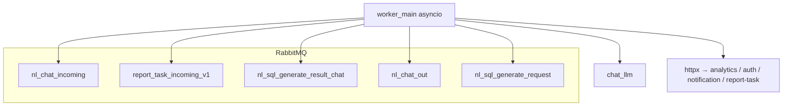

# nl-orchestrator-worker — внутренняя архитектура

Основная логика сосредоточена в **`worker_main.py`** (обработка состояний, таймауты, маршрутизация типов сообщений). **`chat_llm.py`** инкапсулирует вызовы модели для черновика ответа и рассуждений.
