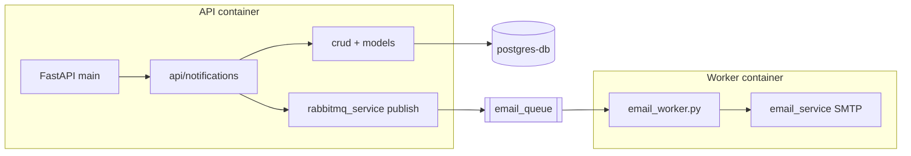

# notification-service — внутренняя архитектура

`worker.py` в репозитории может дублировать или дополнять логику воркера — актуальную точку входа для compose смотрите в [`docker-compose.yml`](../../docker-compose.yml).
