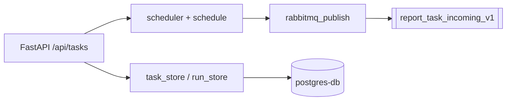

# report-task-service — внутренняя архитектура

- **scheduler** периодически (`DISPATCH_INTERVAL_SECONDS`) выбирает задачи и публикует прогон в RabbitMQ.
- **enqueue_task_run** вызывается из API при ручном запуске или из планировщика.
