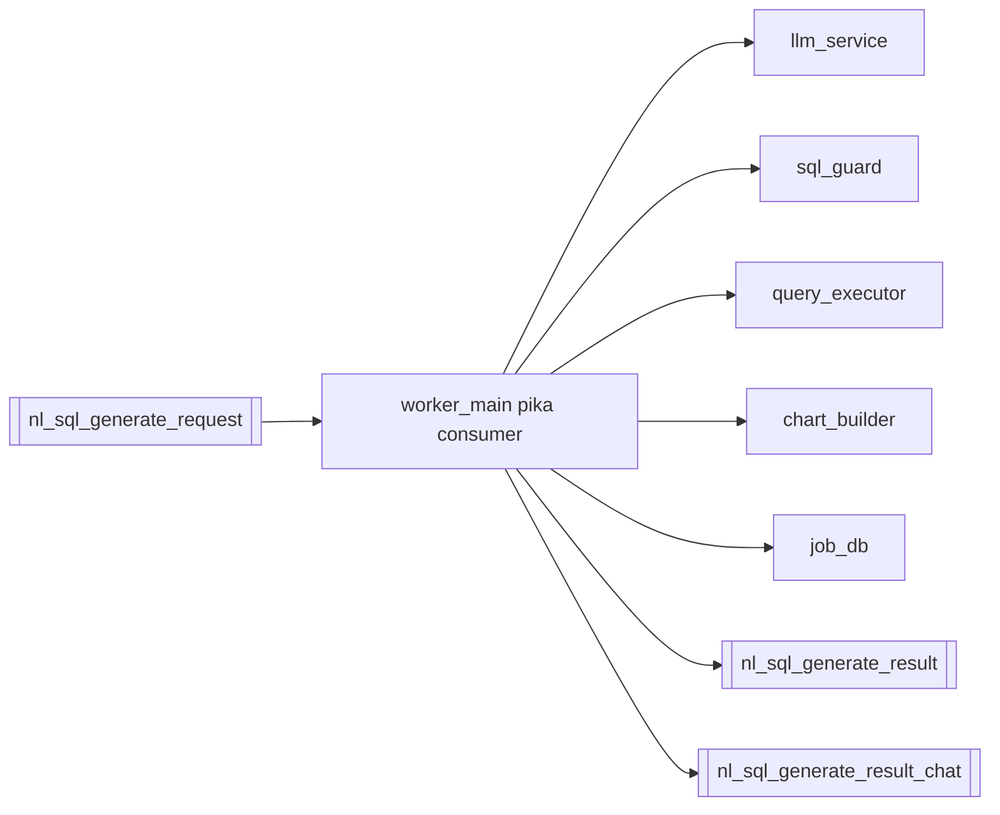

# sql-generator-worker — внутренняя архитектура

```mermaid
flowchart LR
    QIN[["nl_sql_generate_request"]]
    WM["worker_main pika consumer"]
    LLM["llm_service"]
    GU["sql_guard"]
    EX["query_executor"]
    CH["chart_builder"]
    JOB["job_db"]
    QOUT1[["nl_sql_generate_result"]]
    QOUT2[["nl_sql_generate_result_chat"]]
    QIN --> WM
    WM --> LLM
    WM --> GU
    WM --> EX
    WM --> CH
    WM --> JOB
    WM --> QOUT1
    WM --> QOUT2
```

Реализация на **pika** (синхронный consumer) в отличие от asyncio-части BFF/nl-orchestrator.
